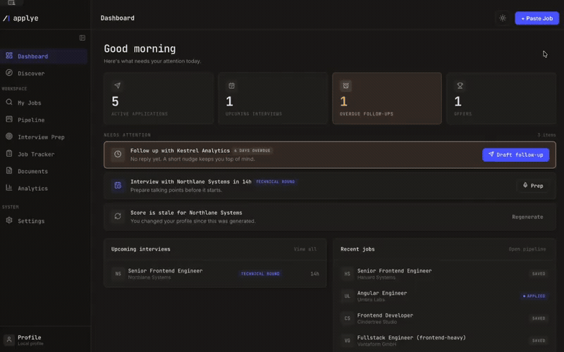
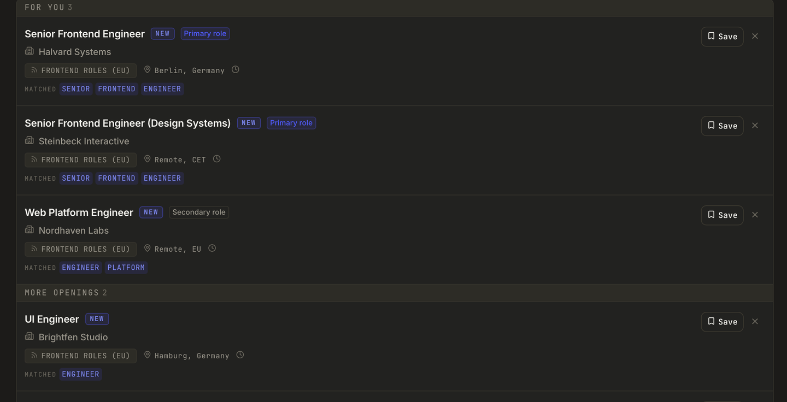

<p align="center">
  <picture>
    <source media="(prefers-color-scheme: dark)" srcset="docs/assets/brand/wordmark-dark.svg">
    
  </picture>
</p>

<div align="center">

[English](README.md) | [Español](README.es.md) | [Deutsch](README.de.md) | [Русский](README.ru.md) | [Українська](README.uk.md) | [Polski](README.pl.md)

</div>

<p align="center">
  <em>Firmy używają AI, żeby filtrować kandydatów. Applye daje kandydatom desktop, żeby odpowiedzieć.</em><br>
  <strong>Szkice są zautomatyzowane. Wysyłanie nie.</strong>
</p>

<p align="center">
  
</p>

<p align="center">
  
  
  
  
  
  
  <br>
  
  
  
</p>

<p align="center">
  <a href="https://applye.dev">Strona</a> ·
  <a href="https://applye.dev/docs">Dokumentacja</a> ·
  <a href="https://applye.dev/methodology">Metodologia</a> ·
  <a href="ROADMAP.md">Plan rozwoju</a> ·
  <a href="CHANGELOG.md">Historia zmian</a>
</p>

---

<!-- PLACEHOLDER: GIF demonstracyjny. Nagranie ekranu 30-45s głównej pętli (wklej ogłoszenie -> sprawdzenie rekrutera -> dopasowane CV -> pipeline), szerokość ok. 800px, zapisane jako docs/assets/demo.gif. -->
<p align="center">
  
</p>

**Applye** to open-source'owa, local-first aplikacja desktopowa do szukania pracy ze wsparciem AI.
Ocenia oferty względem twojego profilu, dopasowuje CV do każdego ogłoszenia, przygotowuje szkice
listów motywacyjnych i wiadomości follow-up, pomaga przygotować się do rozmów i prowadzi cały
pipeline - wszystko na twoim komputerze. Bez chmury, bez konta, bez telemetrii. Podłączasz AI, za
które już płacisz, a każda wysyłka pozostaje decyzją człowieka.

Zbudowana najpierw dla rynku niemieckiego i unijnego, przydatna wszędzie.

## Spis treści

- [Dlaczego Applye](#dlaczego-applye)
- [Funkcje](#funkcje)
- [Szybki start](#szybki-start)
- [Użycie: główna pętla](#użycie-główna-pętla)
- [Jak to działa](#jak-to-działa)
- [Zrzuty ekranu](#zrzuty-ekranu)
- [Struktura projektu](#struktura-projektu)
- [Stos technologiczny](#stos-technologiczny)
- [Plan rozwoju](#plan-rozwoju)
- [Współtworzenie](#współtworzenie)
- [O autorze](#o-autorze)
- [Zastrzeżenie](#zastrzeżenie)
- [Licencja](#licencja)

## Dlaczego Applye

**Wzmacnianie, nie automatyzacja.** To pierwsza zasada i wszystko inne się jej podporządkowuje.

AI pomaga. Ty decydujesz. Applye nigdy nie zaaplikuje, nie wyśle ani nie złoży niczego automatycznie
w twoim imieniu. Ocenia, szkicuje i podpowiada - a potem oddaje ci kontrolę. Każdy wynik AI to
propozycja, którą czytasz, edytujesz i akceptujesz albo wyrzucasz. Żaden agent w tle nie reprezentuje
cię po cichu przed rekruterem.

Dlaczego to ważne:

- Rekruter czy hiring manager to człowiek, a relacja należy do ciebie, nie do bota.
- Masowe automatyczne aplikacje to szum; sens ma narzędzie, które pomaga wysyłać _mniej, ale lepszych_.
- To ty odpowiadasz za każde słowo, które wychodzi pod twoim nazwiskiem.

Jeśli jakaś funkcja wymagałaby oddania tej kontroli - nie zostanie wydana.

## Funkcje

| Funkcja                              | Co robi                                                                                                                                                                                                         | Tokeny     |
| ------------------------------------ | --------------------------------------------------------------------------------------------------------------------------------------------------------------------------------------------------------------- | ---------- |
| **Dashboard**                        | Jeden ekran ze stanem pipeline'u, zaległymi follow-upami i ostatnią aktywnością.                                                                                                                                | 0          |
| **Discover**                         | Skanuje skonfigurowane źródła (Remotive, Himalayas, kanały RSS, portale Greenhouse, Lever, Ashby) po HTTPS, filtruje lokalnie po słowach kluczowych i geografii i pokazuje ocenę dopasowania dla każdej oferty. | 0          |
| **Pipeline wklejania**               | Wklej dowolne ogłoszenie; Applye wyciąga firmę, stanowisko, wynagrodzenie i język, uruchamia deterministyczne sprawdzenie wiarygodności (sygnały ghost jobów i oszustw) i zapisuje ofertę.                      | 0          |
| **Sprawdzenie rekrutera**            | Opcjonalna analiza AI oferty względem twojego profilu: ocena dopasowania, brakujące słowa kluczowe, czerwone flagi i szczery werdykt, zanim zainwestujesz czas.                                                 | opt-in     |
| **Dopasowanie CV**                   | Wieloprzebiegowe dopasowanie profilu do ogłoszenia - przeglądasz każdą zmianę - z eksportem do PDF.                                                                                                             | opt-in     |
| **Listy motywacyjne**                | Szkic listu pod każdą ofertę, zbudowany z twojego profilu i ogłoszenia, do przejrzenia i eksportu. Ty edytujesz, ty wysyłasz.                                                                                   | opt-in     |
| **Kanban pipeline'u**                | Aplikacja, rozmowa, oferta - przeciągaj oferty między etapami; historia statusów zapisuje się sama.                                                                                                             | 0          |
| **Tracker i follow-upy**             | Każda aplikacja z datami, statusami, notatkami i szkicami follow-upów, gdy oferta milknie.                                                                                                                      | 0 / opt-in |
| **Przygotowanie do rozmów**          | Oś czasu etapów rozmów dla każdej aplikacji - daty, rozmówcy, statusy i twoje notatki.                                                                                                                          | 0          |
| **Analityka**                        | Konwersja lejka, wiek pipeline'u, rozkład miejsc aplikowania - liczone lokalnie z twoich danych.                                                                                                                | 0          |
| **Narzędzia dla rynku niemieckiego** | Raport Eigenbemühungen dla Agentur für Arbeit, dokumenty po niemiecku, świadomość Blue Card.                                                                                                                    | 0 / opt-in |
| **Wielojęzyczny interfejs**          | Angielski, niemiecki, rosyjski, hiszpański, francuski, ukraiński.                                                                                                                                               | 0          |

Kolumna "Tokeny" to kontrakt projektowy: wszystko oznaczone **0** działa całkowicie offline na
deterministycznym kodzie. AI zużywa się tylko tam, gdzie naprawdę potrzebny jest osąd, i tylko gdy
klikniesz.

## Szybki start

### Pobieranie

> **PLACEHOLDER: linki do wydań.** Instalatory (Windows `.msi`, macOS `.dmg`, Linux
> `.AppImage`/`.deb`) pojawią się na [stronie Releases](https://github.com/vitala89/applye/releases)
> przy publicznym starcie. Do tego czasu - kompilacja ze źródeł poniżej.

### Kompilacja ze źródeł

**Wymagania:** Node 20+, Rust (stable, edycja 2021) oraz
[zależności systemowe Tauri 2](https://v2.tauri.app/start/prerequisites/) dla twojego systemu.

```bash
git clone https://github.com/vitala89/applye.git
cd applye
npm install

npm run desktop:dev      # uruchom aplikację Tauri + Angular w trybie dev
```

Inne przydatne skrypty:

```bash
npm run desktop:build    # produkcyjna kompilacja aplikacji desktopowej
npm run web:dev          # lokalne uruchomienie strony applye.dev
npm test                 # uruchomienie testów
npm run lint             # lint wszystkich projektów
npm run type-check       # sprawdzenie typów wszystkich projektów
```

Funkcje AI są wyłączone, dopóki nie dodasz klucza lub mostka CLI w **Ustawieniach**. Aplikacja jest
w pełni użyteczna bez nich.

## Użycie: główna pętla

1. **Wklej** opis stanowiska (albo pozwól, by **Discover** przynosił oferty z twoich źródeł).
2. **Sprawdź** - deterministyczna weryfikacja wiarygodności, potem opcjonalna analiza dopasowania przez AI.
3. **Dopasuj** - wieloprzebiegowe dopasowanie CV, które przeglądasz linia po linii, z eksportem do PDF.
4. **Aplikuj** - ty kopiujesz, ty otwierasz ogłoszenie, ty wysyłasz. Applye to zapisuje; nigdy nie klika za ciebie.
5. **Śledź** - oferta wędruje po kanbanie; gdy zapada cisza, pojawiają się szkice follow-upów.
6. **Przygotuj się** - śledź etapy rozmów na osi czasu i trzymaj notatki przy każdej ofercie.

<!-- PLACEHOLDER: wideo instruktażowe. 2-3-minutowy narracyjny przewodnik po głównej pętli na YouTube; wstaw tu miniaturę docs/assets/walkthrough-thumb.png z linkiem do wideo. -->

## Jak to działa

**Local-first i prywatnie.** Twój profil, lista ofert, notatki i wygenerowane dokumenty żyją w
lokalnej bazie SQLite na twoim komputerze. Główne przepływy działają zupełnie bez sieci. Bez kont,
bez telemetrii, bez synchronizacji z chmurą. Nic z twojego poszukiwania nie opuszcza urządzenia,
dopóki _ty_ nie uruchomisz wywołania AI - a nawet wtedy wysyłane jest tylko minimum potrzebne do tej
jednej prośby. Przyjazne RODO, bo nie ma czego wyciec - nie istnieje serwer z twoimi danymi.

**Własne AI.** Applye nie dołącza modelu i nie odsprzedaje tokenów. Podłączasz AI, za które już
płacisz:

- **Klucz API** - wskaż Applye API dostawcy (Anthropic Claude, OpenAI, Google Gemini, DeepSeek) z własnym kluczem.
- **Mostek CLI** - albo przez lokalne CLI AI, które już masz (Claude Code, Codex, Gemini CLI).

Tak czy inaczej klucze są twoje, rachunki są twoje, a cała aplikacja działa też z wyłączonym AI.

**Ekonomia tokenów.** AI jest traktowane jak rzadki, płatny zasób - nie rozsypywane wszędzie:

- **Wszystko jest cache'owane.** Identyczne wejścia nigdy nie płacą dwa razy (`jd_hash -> scoring`, `input_hash -> output`).
- **Tylko wywołania opt-in.** Nic nie trafia do modelu, dopóki nie poprosisz.
- **Oszczędne prompty.** Funkcje ograniczają się do najmniejszego użytecznego zapytania, więc
  prawdziwe poszukiwanie pracy kosztuje centy, nie subskrypcję.

**O legalności źródeł.** Applye to narzędzie, które kierujesz na ogłoszenia, na które **ty** i tak
patrzysz. Nie scrapuje portali z ofertami, nie omija logowania i nie zbiera ogłoszeń na skalę.
Discover odpytuje wyłącznie publiczne API i kanały przeznaczone do odczytu przez oprogramowanie.
Szanuj regulaminy serwisów, z których korzystasz - aplikacja jest zbudowana tak, żebyś pozostawał po
właściwej stronie: nigdy nie automatyzuje zbierania ani wysyłania.

## Zrzuty ekranu

<!-- PLACEHOLDER: zestaw zrzutów. Zrób każdy ekran w 1440x900 (jasny + ciemny motyw), zapisz w docs/assets/screens/ i podmień komórki-zaślepki. -->

| Dashboard                                                                                                                     | Discover                                                                                                   |
| ----------------------------------------------------------------------------------------------------------------------------- | ---------------------------------------------------------------------------------------------------------- |
|  <br> _PLACEHOLDER: dashboard.png - stan pipeline'u + follow-upy do zrobienia_ |  <br> _PLACEHOLDER: discover.png - feed z ocenami i filtrami_ |

| Szczegóły oferty i ocena                                                                                                                        | Dopasowanie CV                                                                                                     |
| ----------------------------------------------------------------------------------------------------------------------------------------------- | ------------------------------------------------------------------------------------------------------------------ |
|  <br> _PLACEHOLDER: job-detail.png - pierścień oceny, brakujące słowa kluczowe, czerwone flagi_ |  <br> _PLACEHOLDER: tailoring.png - podgląd diff przed eksportem_ |

| Kanban pipeline'u                                                                                                     | Analityka                                                                                                   |
| --------------------------------------------------------------------------------------------------------------------- | ----------------------------------------------------------------------------------------------------------- |
|  <br> _PLACEHOLDER: pipeline.png - kolumny aplikacja / rozmowa / oferta_ |  <br> _PLACEHOLDER: analytics.png - lejek + wiek pipeline'u_ |

## Struktura projektu

```
applye/
├── apps/
│   ├── desktop/          # aplikacja desktopowa Tauri 2
│   │   ├── src/          # frontend Angular (dashboard, discover, oferty, pipeline, ...)
│   │   └── src-tauri/    # backend Rust: SQLite, silnik skanowania, scoring, mostek AI
│   ├── web/              # applye.dev - landing, dokumentacja, metodologia, changelog
│   └── mobile/           # zaślepka pod przyszłą aplikację towarzyszącą
├── libs/
│   ├── core/             # modele domenowe i interfejsy
│   ├── data/             # wrappery Tauri invoke i abstrakcje usług
│   ├── ui/               # współdzielone komponenty Angular i tokeny designu
│   ├── i18n/             # tłumaczenia (en, de, ru, es, fr, uk)
│   └── skills/           # wersjonowana treść promptów/skilli
├── docs/                 # dokumentacja architektury, produktu i designu
└── design-system/        # źródło prawdy o designie każdego ekranu
```

## Stos technologiczny

| Warstwa            | Wybór                                     | Dlaczego                                                 |
| ------------------ | ----------------------------------------- | -------------------------------------------------------- |
| Powłoka desktopowa | [Tauri 2](https://v2.tauri.app)           | Natywny webview, małe binarki, backend w Rust            |
| Backend            | Rust 2021 + SQLite (sqlx)                 | Deterministyczna, szybka, w pełni offline warstwa danych |
| Frontend           | Angular 21 + TypeScript                   | Signals, komponenty standalone, ścisłe typy              |
| Stan               | NgRx Signals                              | Lokalny, przewidywalny stan UI                           |
| Monorepo           | [Nx](https://nx.dev)                      | Jedno repo dla desktopu, weba i wspólnych bibliotek      |
| Jakość             | Jest, ESLint, Prettier, Husky, commitlint | Testy i conventional commits wymagane                    |

Układ opisuje [`docs/architecture.md`](docs/architecture.md), a każdą zmianę weryfikuje
[filtr decyzji](docs/decision-filter.md).

## Plan rozwoju

Krótkoterminowy plan żyje w [ROADMAP.md](ROADMAP.md); wydana praca trafia do
[CHANGELOG.md](CHANGELOG.md). Przed nami: więcej źródeł w Discover, głębsze przygotowanie do rozmów
i instalowalne buildy na wszystkie trzy platformy.

## Współtworzenie

Wkład mile widziany - issues, dokumentacja, tłumaczenia i kod.

- Przeczytaj [CONTRIBUTING.md](CONTRIBUTING.md): setup, praca na gałęziach i konwencje commitów.
- Bądź życzliwy: [CODE_OF_CONDUCT.md](CODE_OF_CONDUCT.md).
- Znalazłeś podatność? Zobacz [SECURITY.md](SECURITY.md) - prosimy, nie otwieraj publicznego issue.

## O autorze

Applye buduje **[Vitalii Kasap](https://vitaliikasap.com)**, inżynier frontendu mieszkający w
Niemczech, w trakcie dokładnie takiego poszukiwania pracy, dla jakiego aplikacja powstała. Każda
funkcja wychodzi dlatego, że była potrzebna w prawdziwym poszukiwaniu, a nie dlatego, że dobrze
wygląda w demo.

**Też open source:** filozofia pipeline'u Applye jest otwarcie zainspirowana projektem
[career-ops](https://github.com/santifer/career-ops) Santiago Fernándeza de Valderrama Aparicio -
znakomitym podejściem CLI-first do tego samego problemu. career-ops daje deweloperom CLI; Applye
daje wszystkim desktop. Jeśli mieszkasz w terminalu - zostaw mu gwiazdkę.

## Zastrzeżenie

Applye to narzędzie osobistej produktywności. Nie gwarantuje rozmów, ofert ani zatrudnienia. Wyniki
AI to szkice, które mogą być błędne - sprawdzaj wszystko przed wysłaniem. Applye nigdy nie wysyła
aplikacji w twoim imieniu i nigdy nie zmyśla doświadczenia; szczerość ponad koloryzowanie to zasada
projektowa, nie sugestia. Oprogramowanie jest dostarczane na [licencji MIT](LICENSE) "tak jak jest",
bez jakiejkolwiek gwarancji. Applye nie jest powiązane z żadnym portalem pracy, dostawcą ATS ani
dostawcą AI wymienionym w tym dokumencie.

## Licencja

[MIT](LICENSE) © 2026 Vitalii Kasap
