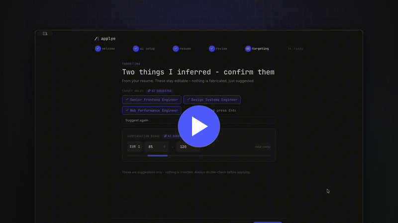

<p align="center">
  <picture>
    <source media="(prefers-color-scheme: dark)" srcset="docs/assets/brand/wordmark-dark.svg">
    
  </picture>
</p>

<div align="center">

[English](README.md) | [Español](README.es.md) | [Deutsch](README.de.md) | [Русский](README.ru.md) | [Українська](README.uk.md) | [Polski](README.pl.md)

</div>

<p align="center">
  <em>Компании используют ИИ, чтобы фильтровать кандидатов. Applye даёт кандидатам десктоп, чтобы ответить.</em><br>
  <strong>Черновики автоматизированы. Отправка - нет.</strong>
</p>

<p align="center">
  
</p>

<p align="center">
  
  
  
  
  
  
  <br>
  
  
  
</p>

<p align="center">
  <a href="https://applye.dev">Сайт</a> ·
  <a href="https://applye.dev/docs">Документация</a> ·
  <a href="https://applye.dev/methodology">Методология</a> ·
  <a href="ROADMAP.md">Дорожная карта</a> ·
  <a href="CHANGELOG.md">История изменений</a>
</p>

---

<p align="center">
  
</p>

**Applye** - это open-source local-first десктоп-приложение для поиска работы с помощью ИИ. Оно
оценивает вакансии относительно вашего профиля, адаптирует CV под каждую позицию, готовит черновики
сопроводительных писем и follow-up сообщений, помогает готовиться к интервью и ведёт весь пайплайн -
всё на вашей машине. Без облака, без аккаунта, без телеметрии. Вы подключаете ИИ, за который уже
платите, а каждая отправка остаётся решением человека.

Сделано в первую очередь для рынка Германии и ЕС, полезно везде.

## Содержание

- [Почему Applye](#почему-applye)
- [Возможности](#возможности)
- [Быстрый старт](#быстрый-старт)
- [Использование: основной цикл](#использование-основной-цикл)
- [Как это работает](#как-это-работает)
- [Где ищет Discover](#где-ищет-discover)
- [Скриншоты](#скриншоты)
- [Структура проекта](#структура-проекта)
- [Технологии](#технологии)
- [Дорожная карта](#дорожная-карта)
- [Частые вопросы](#частые-вопросы)
- [Как помочь проекту](#как-помочь-проекту)
- [Об авторе](#об-авторе)
- [Тоже open source](#тоже-open-source)
- [Отказ от ответственности](#отказ-от-ответственности)
- [Лицензия](#лицензия)
- [Контакты](#контакты)

## Почему Applye

**Усиление, а не автоматизация.** Это первый принцип, и всё остальное подчиняется ему.

ИИ помогает. Решаете вы. Applye никогда не будет автоматически откликаться, отправлять или подавать
что-либо от вашего имени. Он оценивает, готовит черновики и предлагает - а затем возвращает
управление вам. Каждый результат ИИ - это предложение, которое вы читаете, правите и принимаете или
выбрасываете. Никакой фоновый агент не представляет вас рекрутеру втихую.

Почему это важно:

- Рекрутер или нанимающий менеджер - человек, и отношения с ним ваши, а не бота.
- Массовые автоматические отклики - это шум; смысл в инструменте, который помогает отправлять
  _меньше, но лучше_.
- Вы отвечаете за каждое слово, которое уходит под вашим именем.

Если функция требует отказаться от этого контроля - она не выйдет.

## Возможности

| Функция                            | Что делает                                                                                                                                                                                                           | Токены     |
| ---------------------------------- | -------------------------------------------------------------------------------------------------------------------------------------------------------------------------------------------------------------------- | ---------- |
| **Дашборд**                        | Один экран: состояние пайплайна, ожидающие follow-up и последняя активность.                                                                                                                                         | 0          |
| **Discover**                       | Сканирует настроенные источники (Remotive, Himalayas, RSS-ленты, порталы Greenhouse, Lever, Ashby) по HTTPS, фильтрует по ключевым словам и географии локально и показывает оценку соответствия для каждой вакансии. | 0          |
| **Пайплайн вставки**               | Вставьте любое описание вакансии; Applye извлекает компанию, должность, зарплату и язык, выполняет детерминированную проверку легитимности (признаки фейковых вакансий и скама) и сохраняет вакансию.                | 0          |
| **Проверка рекрутера**             | Опциональный ИИ-разбор вакансии относительно вашего профиля: оценка соответствия, недостающие ключевые слова, красные флаги и честный вердикт до того, как вы вложите время.                                         | opt-in     |
| **Адаптация CV**                   | Многопроходная адаптация профиля под вакансию - вы проверяете каждое изменение - экспорт в PDF.                                                                                                                      | opt-in     |
| **Сопроводительные письма**        | Черновик письма под каждую вакансию на основе вашего профиля и описания роли, готовый к проверке и экспорту. Вы редактируете, вы отправляете.                                                                        | opt-in     |
| **Канбан пайплайна**               | Отклик, интервью, оффер - перетаскивайте вакансии по этапам; история статусов записывается сама.                                                                                                                     | 0          |
| **Трекер и follow-up**             | Каждый отклик с датами, статусами, заметками и черновиками напоминаний, когда вакансия замолкает.                                                                                                                    | 0 / opt-in |
| **Подготовка к интервью**          | Таймлайн этапов интервью по каждому отклику - даты, интервьюеры, статусы и ваши заметки.                                                                                                                             | 0          |
| **Аналитика**                      | Конверсия воронки, возраст пайплайна, разбивка по площадкам - считается локально по вашим данным.                                                                                                                    | 0          |
| **Инструменты для рынка Германии** | Отчёт Eigenbemühungen для Agentur für Arbeit, документы на немецком, учёт Blue Card.                                                                                                                                 | 0 / opt-in |
| **Многоязычный интерфейс**         | Английский, немецкий, русский, испанский, французский, украинский.                                                                                                                                                   | 0          |

Колонка "Токены" - это дизайн-контракт: всё, что помечено **0**, работает полностью офлайн на
детерминированном коде. ИИ тратится только там, где действительно нужно суждение, и только когда вы
нажимаете кнопку.

## Быстрый старт

### Скачать

> **PLACEHOLDER: ссылки на релизы.** Установочные сборки (Windows `.msi`, macOS `.dmg`, Linux
> `.AppImage`/`.deb`) появятся на [странице Releases](https://github.com/vitala89/applye/releases)
> к публичному запуску. До этого - сборка из исходников ниже.

### Сборка из исходников

**Требования:** Node 20+, Rust (stable, издание 2021) и
[системные зависимости Tauri 2](https://v2.tauri.app/start/prerequisites/) для вашей ОС.

```bash
git clone https://github.com/vitala89/applye.git
cd applye
npm install

npm run desktop:dev      # запуск Tauri + Angular приложения в dev-режиме
```

Другие полезные скрипты:

```bash
npm run desktop:build    # продакшен-сборка десктоп-приложения
npm run web:dev          # локальный запуск сайта applye.dev
npm test                 # запуск тестов
npm run lint             # линт всех проектов
npm run type-check       # проверка типов всех проектов
```

Функции ИИ выключены, пока вы не добавите ключ или CLI-мост в **Настройках**. Приложение полностью
работоспособно и без них.

## Использование: основной цикл

1. **Вставьте** описание вакансии (или пусть **Discover** сам находит вакансии из ваших источников).
2. **Проверьте** - детерминированная проверка легитимности, затем опциональный ИИ-разбор соответствия.
3. **Адаптируйте** - многопроходная адаптация CV, которую вы проверяете строка за строкой, с экспортом в PDF.
4. **Откликнитесь** - вы копируете, вы открываете вакансию, вы отправляете. Applye записывает; он никогда не кликает за вас.
5. **Отслеживайте** - вакансия движется по канбану; при тишине появляются черновики follow-up.
6. **Готовьтесь** - ведите этапы интервью на таймлайне и храните заметки по каждой вакансии.

<p align="center">
  <a href="https://applye.dev/docs/guide/tour/">
    
  </a>
  <br>
  <em>Немой обзор шести экранов первого запуска, на applye.dev.</em>
</p>

## Как это работает

**Local-first и приватно.** Ваш профиль, список вакансий, заметки и сгенерированные документы живут
в локальной базе SQLite на вашей машине. Основные сценарии работают вообще без сети. Никаких
аккаунтов, телеметрии и облачной синхронизации. Ничего о вашем поиске не покидает устройство, пока
_вы_ не запустите ИИ-вызов, и даже тогда отправляется только минимум для этого одного запроса.
Дружелюбно к GDPR, потому что утекать нечему - сервера с вашими данными просто нет.

**Свой ИИ.** Applye не встраивает модель и не перепродаёт токены. Вы подключаете ИИ, за который уже
платите:

- **API-ключ** - направьте Applye на API провайдера (Anthropic Claude, OpenAI, Google Gemini, DeepSeek) со своим ключом.
- **CLI-мост** - или через локальный ИИ CLI, который у вас уже есть (Claude Code, Codex, Gemini CLI).

В любом случае ключи ваши, оплата ваша, и всё приложение работает даже с выключенным ИИ.

**Экономия токенов.** ИИ - это дефицитный платный ресурс, а не приправа ко всему:

- **Всё кешируется.** Одинаковый ввод никогда не оплачивается дважды (`jd_hash -> scoring`, `input_hash -> output`).
- **Только opt-in вызовы.** Ничего не уходит в модель, пока вы не попросите.
- **Экономные промпты.** Функции ограничены минимально полезным запросом, поэтому реальный поиск
  работы стоит центы, а не подписку.

**О легальности источников.** Applye - инструмент, который вы направляете на вакансии, которые
**вы** уже смотрите. Он не скрейпит job-борды, не обходит логины и не собирает вакансии в промышленных
масштабах. Discover обращается только к публичным API и лентам, предназначенным для чтения
программами. Уважайте условия использования любых сайтов - приложение устроено так, чтобы держать
вас на правильной стороне: оно никогда не автоматизирует сбор и отправку.

## Где ищет Discover

Applye поставляется с набором встроенных источников, и **все они выключены по умолчанию**. Сбор
данных - явный выбор пользователя: вы включаете те источники, которые подходят вашему рынку, и до
этого не загружается ничего. Каждый источник - публичный API или RSS-лента, предназначенная для
машинного чтения, и у каждого в приложении есть пометка о правовом основании.

| Источник                 | Тип | Рынок    | Примечание                                            |
| ------------------------ | --- | -------- | ----------------------------------------------------- |
| Remotive                 | API | Весь мир | Удалённые вакансии, публичный API                     |
| We Work Remotely         | RSS | Весь мир | Публичная RSS-лента                                   |
| Himalayas                | API | Весь мир | Удалённые вакансии, публичный API                     |
| Jobicy                   | RSS | Весь мир | Публичная RSS-лента                                   |
| Arbeitnow                | API | Европа   | Публичный API, много немецкоязычных вакансий          |
| Bundesagentur für Arbeit | API | Германия | Официальный REST API федерального агентства занятости |
| No Fluff Jobs            | API | Польша   | Публичный API, фокус на IT                            |
| DOU.ua                   | RSS | Украина  | Публичная RSS-лента                                   |
| Djinni.co                | RSS | Украина  | Публичная RSS-лента                                   |
| Habr Career              | RSS | RU-рынок | Публичная RSS-лента                                   |
| TrudVsem (Роструд)       | API | RU-рынок | Официальный публичный API                             |

Дополнительно можно добавить **карьерные порталы компаний**: Greenhouse, Lever, Ashby и Personio.
Укажите Applye на портал компании - её вакансии появятся в ленте Discover наравне с агрегаторами.
Также поддерживается любая произвольная RSS-лента.

Чего Applye намеренно **не делает**: не парсит HTML джоб-бордов, не логинится куда-либо от вашего
имени и не выкачивает вакансии массово. Если у сайта нет машиночитаемой ленты, Applye его не читает.

## Скриншоты

| Дашборд                                                                                      | Discover                                                                                                                    |
| -------------------------------------------------------------------------------------------- | --------------------------------------------------------------------------------------------------------------------------- |
|  <br> _состояние пайплайна + follow-up к сроку_ |  <br> _лента, сгруппированная по целевым ролям, и совпадения по каждой строке_ |

| Вакансия и проверка рекрутера                                                                                   | Адаптация CV                                                                                                               |
| --------------------------------------------------------------------------------------------------------------- | -------------------------------------------------------------------------------------------------------------------------- |
|  <br> _недостающие ключевые слова, проверка ATS и красные флаги_ |  <br> _шаг проверки в мастере: адаптированное CV и сопроводительное письмо_ |

| Канбан пайплайна                                                                       | Аналитика                                                                                            |
| -------------------------------------------------------------------------------------- | ---------------------------------------------------------------------------------------------------- |
|  <br> _колонки отклик / интервью / оффер_ |  <br> _счётчики, воронка откликов и объём по неделям_ |

## Структура проекта

```
applye/
├── apps/
│   ├── desktop/          # десктоп-приложение на Tauri 2
│   │   ├── src/          # Angular-фронтенд (дашборд, discover, вакансии, пайплайн, ...)
│   │   └── src-tauri/    # Rust-бэкенд: SQLite, движок сканирования, скоринг, ИИ-мост
│   ├── web/              # applye.dev - лендинг, документация, методология, changelog
│   └── mobile/           # заглушка для будущего мобильного приложения
├── libs/
│   ├── core/             # доменные модели и интерфейсы
│   ├── data/             # обёртки Tauri invoke и сервисные абстракции
│   ├── ui/               # общие Angular-компоненты и дизайн-токены
│   ├── i18n/             # переводы (en, de, ru, es, fr, uk)
│   └── skills/           # версионируемый контент промптов/скиллов
├── docs/                 # документация по архитектуре, продукту и дизайну
└── design-system/        # источник истины по дизайну каждого экрана
```

## Технологии

| Слой             | Выбор                                     | Почему                                                   |
| ---------------- | ----------------------------------------- | -------------------------------------------------------- |
| Десктоп-оболочка | [Tauri 2](https://v2.tauri.app)           | Нативный webview, маленькие бинарники, Rust-бэкенд       |
| Бэкенд           | Rust 2021 + SQLite (sqlx)                 | Детерминированный, быстрый, полностью офлайн слой данных |
| Фронтенд         | Angular 21 + TypeScript                   | Signals, standalone-компоненты, строгие типы             |
| Состояние        | NgRx Signals                              | Локальное предсказуемое состояние UI                     |
| Монорепозиторий  | [Nx](https://nx.dev)                      | Один репозиторий для десктопа, веба и общих библиотек    |
| Качество         | Jest, ESLint, Prettier, Husky, commitlint | Тесты и conventional commits обязательны                 |


Структура описана в [`docs/architecture.md`](docs/architecture.md), а каждое изменение проверяется
через [фильтр решений](docs/decision-filter.md).

## Дорожная карта

Ближайший план живёт в [ROADMAP.md](ROADMAP.md); выпущенная работа фиксируется в
[CHANGELOG.md](CHANGELOG.md). Впереди: больше источников в Discover, более глубокая подготовка к
интервью и установочные сборки для всех трёх платформ.

## Частые вопросы

**Что такое Applye?**
Applye - бесплатное десктопное приложение с открытым исходным кодом для поиска работы с помощью ИИ,
работающее локально. Оно оценивает вакансии относительно вашего профиля, адаптирует резюме под
каждую позицию, готовит сопроводительные письма и напоминания, ведёт весь пайплайн на вашей машине.
Работает на Windows, macOS и Linux и никогда не откликается на вакансии за вас.

**Applye бесплатен? Нужен ли аккаунт?**
Да, бесплатен и распространяется по лицензии MIT, аккаунт не нужен. Нет регистрации, нет сервера,
нет подписки: вы скачиваете приложение, и оно работает. Платить можно только за ИИ, который вы
подключаете, и платите вы напрямую своему провайдеру, а не Applye.

**Applye откликается на вакансии за меня?**
Нет и не будет. Applye оценивает, готовит черновики и предлагает; вы проверяете, правите и
отправляете. Нет ни авто-отклика, ни авто-отправки, ни фонового агента, который общается с
рекрутёрами от вашего имени. Человек в контуре - первый принцип продукта, а не настройка.

**Где хранятся мои данные?**
В локальной базе SQLite на вашей машине, рядом с документами, которые Applye создаёт. Нет облака,
нет синхронизации, нет телеметрии. Ничего не покидает устройство, пока вы сами не запустите
ИИ-запрос, и тогда провайдеру уходит только минимум, нужный для этого одного запроса.

**Каких ИИ-провайдеров поддерживает Applye?**
Вы приносите своего: ключ Anthropic Claude или DeepSeek либо мост к локальному ИИ-CLI - Claude Code
или Codex (через него доступны и модели OpenAI). Ключи и оплата остаются вашими. Все ИИ-функции
включаются вручную, и приложение полностью работоспособно с выключенным ИИ.

**Можно пользоваться без ИИ или без интернета?**
Да. Дашборд, канбан пайплайна, трекер, таймлайн интервью, аналитика и детерминированная проверка
легитимности вакансии работают офлайн и без токенов. ИИ тратится только там, где действительно
нужно суждение, и только по вашему клику.

**Applye парсит джоб-борды?**
Нет. Discover читает публичные API и RSS-ленты, опубликованные для машинного чтения, плюс карьерные
порталы компаний (Greenhouse, Lever, Ashby, Personio), которые вы добавляете сами. Он не парсит
HTML, не обходит логины и не выкачивает вакансии массово. Все встроенные источники выключены.

**Applye только для Германии?**
Нет. Он сделан в первую очередь под немецкий и европейский рынок - есть отчёт Eigenbemühungen для
Agentur für Arbeit, документы на немецком и учёт Blue Card, - но источники покрывают весь мир,
Польшу, Украину и RU-рынок, а интерфейс говорит на английском, немецком, русском, испанском,
французском и украинском.

**Какие платформы поддерживаются?**
Windows, macOS (Apple Silicon и Intel) и Linux. Установщики публикуются на
[странице релизов](https://github.com/vitala89/applye/releases); сборка из исходников описана в
разделе [Быстрый старт](#быстрый-старт).

## Как помочь проекту

Вклад приветствуется - issues, документация, переводы и код.

- Прочитайте [CONTRIBUTING.md](CONTRIBUTING.md): настройка, работа с ветками и соглашения о коммитах.
- Не знаете, куда написать? [SUPPORT.md](SUPPORT.md) подскажет.
- Будьте доброжелательны: [CODE_OF_CONDUCT.md](CODE_OF_CONDUCT.md).
- Нашли уязвимость? Смотрите [SECURITY.md](SECURITY.md) - пожалуйста, не открывайте публичный issue.

**Applye помог вам что-то найти?**
[Расскажите историю](https://github.com/vitala89/applye/issues/new?template=applye-helped.yml) - это
единственная метрика проекта, потому что внутри приложения ничего не измеряется.

## Об авторе

Applye создаёт **[Виталий Касап (Vitalii Kasap)](https://vitaliikasap.com)**, фронтенд-инженер из
Германии, прямо во время того самого поиска работы, для которого приложение и создано. Каждая
функция выходит потому, что понадобилась в реальном поиске, а не потому, что красиво смотрится в
демо.

## Тоже open source

- **[career-ops](https://github.com/santifer/career-ops)** Сантьяго Фернандеса де Вальдеррамы
  Апарисио - проект, из-за которого захотелось построить это. Блестящее CLI-first решение той же
  задачи: превращает любой ИИ-CLI в командный центр поиска работы. career-ops даёт разработчикам
  CLI; Applye даёт десктоп всем. Если вы живёте в терминале - идите туда и поставьте звезду.

## Отказ от ответственности

Applye - инструмент личной продуктивности. Он не гарантирует интервью, офферы или трудоустройство.
Результаты ИИ - это черновики, которые могут ошибаться: проверяйте всё перед отправкой. Applye
никогда не отправляет отклики от вашего имени и никогда не выдумывает опыт; честность важнее
приукрашивания - это правило дизайна, а не пожелание. Программное обеспечение предоставляется по
[лицензии MIT](LICENSE) "как есть", без каких-либо гарантий. Applye не аффилирован ни с одним
job-бордом, ATS-вендором или ИИ-провайдером, упомянутым в этом документе.

## Лицензия

[MIT](LICENSE) © 2026 Vitalii Kasap

## Контакты

[](https://vitaliikasap.com)
[](https://www.linkedin.com/in/vitaliikasap/)
[](https://x.com/vitala89)
[](https://github.com/vitala89)
[](https://github.com/vitala89/applye/discussions)
